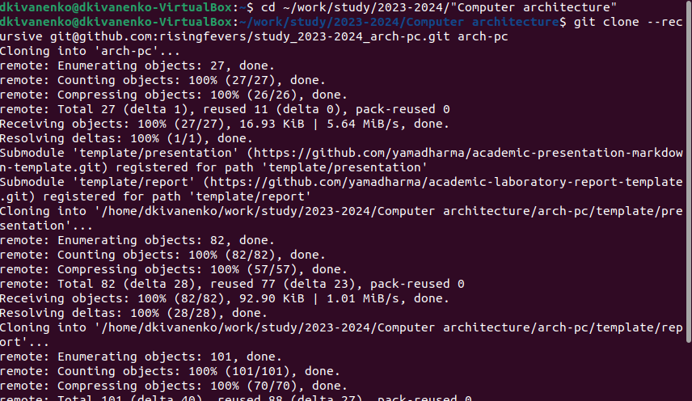

---
## Front matter
title: "Отчет по лабороторной работе №2"
subtitle: "Дисциплина: Архитектура копмьютеров"
author: "Иваненко Дмитрий Кириллович"

## Generic otions
lang: ru-RU
toc-title: "Содержание"

## Bibliography
bibliography: bib/cite.bib
csl: pandoc/csl/gost-r-7-0-5-2008-numeric.csl

## Pdf output format
toc: true # Table of contents
toc-depth: 2
lof: true # List of figures
lot: true # List of tables
fontsize: 12pt
linestretch: 1.5
papersize: a4
documentclass: scrreprt
## I18n polyglossia
polyglossia-lang:
  name: russian
  options:
	- spelling=modern
	- babelshorthands=true
polyglossia-otherlangs:
  name: english
## I18n babel
babel-lang: russian
babel-otherlangs: english
## Fonts
mainfont: PT Serif
romanfont: PT Serif
sansfont: PT Sans
monofont: PT Mono
mainfontoptions: Ligatures=TeX
romanfontoptions: Ligatures=TeX
sansfontoptions: Ligatures=TeX,Scale=MatchLowercase
monofontoptions: Scale=MatchLowercase,Scale=0.9
## Biblatex
biblatex: true
biblio-style: "gost-numeric"
biblatexoptions:
  - parentracker=true
  - backend=biber
  - hyperref=auto
  - language=auto
  - autolang=other*
  - citestyle=gost-numeric
## Pandoc-crossref LaTeX customization
figureTitle: "Рис."
tableTitle: "Таблица"
listingTitle: "Листинг"
lofTitle: "Список иллюстраций"
lotTitle: "Список таблиц"
lolTitle: "Листинги"
## Misc options
indent: true
header-includes:
  - \usepackage{indentfirst}
  - \usepackage{float} # keep figures where there are in the text
  - \floatplacement{figure}{H} # keep figures where there are in the text
---

# Цель работы
Целью данной работы является изучить применение
средств контроля версий, а также приобрести практические навыки по
работе с системой git.

# Выполнение лабораторной работы
2.4.2. Базовая настройка git:
Настроим utf-8 в выводе сообщений git,зададим имя начальной ветки, параметр autocrlf и параметр safecrlf рис. 1.

{#fig:001 width=70%}

2.4.3. Создание SSH ключа
Генерируем ключ рис.2

{#fig:002 width=70%}

Копируем с помощью xclip:

{#fig:003 width=70%}

Далее просто копируем ключ в специальное поле на странице github.com рис 4.

{#fig:004 width=70%}

2.4.4. Сознание рабочего пространства и репозитория курса на основе
Шаблона
Создаю директорию с помощью mkdir, благодаря ключу -p создаю все
директории после домашней ~/work/study/2023-2024/“Computer architecture”
рекурсивно. Далее проверяю с помощью ls правильность выполнения рис.5

{#fig:005 width=70%}

2.4.5. Сознание репозитория курса на основе шаблона
Перехожу по заданной директории и создаю репрезиторий рис.6

{#fig:006 width=70%}

2.4.5 Создание репозитура шаблона на основе шаблона
В консоли меняем директорию

{#fig:007 width=70%}

Копирую ссылку на репрезиторий:

{#fig:008 width=70%}

Далее копирую репрезиторий с помощью git clone –recursive git@github.com:/study_2023–2024_arh-pc.git arch-pc

{#fig:009 width=70%}

4.6 Настройка каталога курса
Перехожу в каталог arch-pc с помощью cd

{#fig:010 width=70%}

Удаляю лишние файлы с помощью утилиты rm и создаю необходимые каталоги

{#fig:011 width=70%}

Отправляю созданные каталоги на сервер, добавляю все созданные каталоги с помощью git add, комментирую и сохраняю изменения как добавление курса с помощью git commit рис. 12

{#fig:012 width=70%}

Далее отправляем изменения на сервер с помощью push

{#fig:013 width=70%}

Проверяю правильность выполнения:

{#fig:014 width=70%}

4.7 Выполнение заданий для самостоятельной работы
1. Перехожу в директорию labs/lab02/report с помощью утилиты cd.
Создаю в каталоге файл для отчета по третьей лабораторной работе с помощью touch

{#fig:015 width=70%}

Перемещаюсь между дерикториями:

{#fig:016 width=70%}

Проверяю местоположение файлов первой лабораторной работы:

{#fig:017 width=70%}

Копируем файлы первой лабороторной работы в указанную директорию (рис. 18 и 19)

{#fig:018 width=70%}

{#fig:019 width=70%}

Добавляю файл на сервер

{#fig:020 width=70%}

Делаю то же самое для второй лабороторной работы. Для этого меняю деректорию, добавляю с помощью git add нужный файл, сохраняю изменения с помощью git
Commit 

{#fig:021 width=70%}

Отправляю в центральный репозиторий сохраненные изменения командой git push -f origin master

{#fig:022 width=70%}

И проверяю правильность на самом сайте:

{#fig:023 width=70%}

ссылка на мой github: https://github.com/risingfevers/study_2023-2024_arch-pc

# Выводы
Я ознакомился с принципами работы средств контроля версий. После базовой настройки git создали иерархию рабочего пространства в локальном репозитории  и на странице git hub.

