---
## Front matter
title: "Отчет по лабораторной работе №3"
subtitle: "Дисциплина: Архитектура компьютеров"
author: "Иваненко Дмитрий Кириллович"

## Generic otions
lang: ru-RU
toc-title: "Содержание"

## Bibliography
bibliography: bib/cite.bib
csl: pandoc/csl/gost-r-7-0-5-2008-numeric.csl

## Pdf output format
toc: true # Table of contents
toc-depth: 2
lof: true # List of figures
lot: true # List of tables
fontsize: 12pt
linestretch: 1.5
papersize: a4
documentclass: scrreprt
## I18n polyglossia
polyglossia-lang:
  name: russian
  options:
	- spelling=modern
	- babelshorthands=true
polyglossia-otherlangs:
  name: english
## I18n babel
babel-lang: russian
babel-otherlangs: english
## Fonts
mainfont: PT Serif
romanfont: PT Serif
sansfont: PT Sans
monofont: PT Mono
mainfontoptions: Ligatures=TeX
romanfontoptions: Ligatures=TeX
sansfontoptions: Ligatures=TeX,Scale=MatchLowercase
monofontoptions: Scale=MatchLowercase,Scale=0.9
## Biblatex
biblatex: true
biblio-style: "gost-numeric"
biblatexoptions:
  - parentracker=true
  - backend=biber
  - hyperref=auto
  - language=auto
  - autolang=other*
  - citestyle=gost-numeric
## Pandoc-crossref LaTeX customization
figureTitle: "Рис."
tableTitle: "Таблица"
listingTitle: "Листинг"
lofTitle: "Список иллюстраций"
lotTitle: "Список таблиц"
lolTitle: "Листинги"
## Misc options
indent: true
header-includes:
  - \usepackage{indentfirst}
  - \usepackage{float} # keep figures where there are in the text
  - \floatplacement{figure}{H} # keep figures where there are in the text
---

# Цель работы

Целью данной лабораторной работы является освоение процедуры оформления отчетов с помощью легковесного языка разметки Markdown.

# Выполнение лабораторной работы
1. Скачивание TexLive.
Скачиваю TexLive с официального сайта, по инструкции, которая размещена на сайте, распаковываю его:

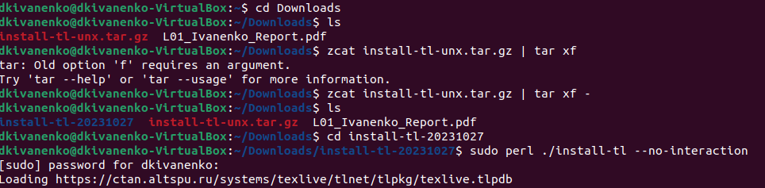{#fig:001 width=70%}

Далее добавляю по инструкции в path:

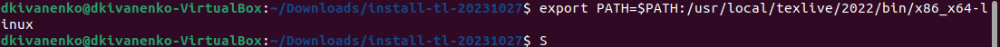{#fig:002 width=70%}

2. Скачивание архивов Pandoc и Pandoc- crossref.
Скачиваю архив Pandoc, версия 2.18:

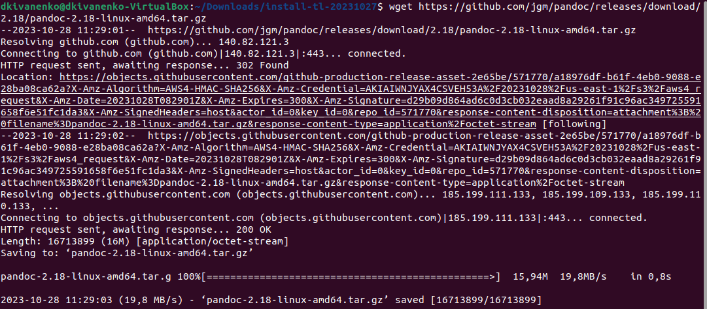{#fig:003 width=70%}

Скачиваю архив Pandoc- crossref, версия 0.3.13.0 :

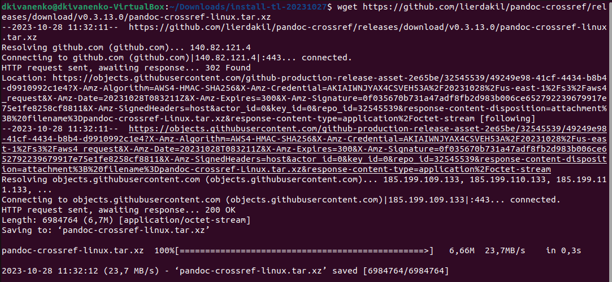{#fig:004 width=70%}

Затем я распаковал все архивы, которые скачал:

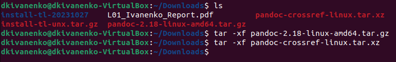{#fig:005 width=70%}

Далее копиую каталоги в /usr/local/bin:

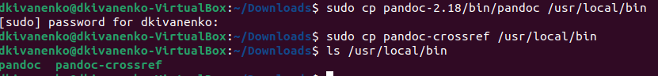{#fig:006 width=70%}

Заполнение отчета по выполнению лабораторной работы №3 с помощью языка разметки Markdown:
Перехожу в каталог, который был создан на прошлой лабороторной работе:

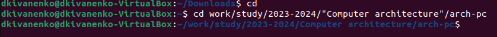{#fig:007 width=70%}

Далее обновляем локальный репризиторий, скачивая изменения с удаленного репризитория:

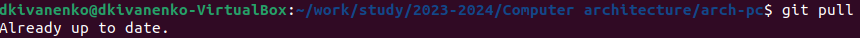{#fig:008 width=70%}

Перехожу в директорий лабораторной работы 3, и пишу команды make, чтобы скомпилировать:

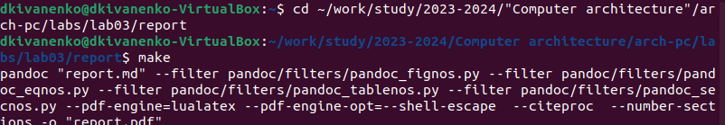{#fig:009 width=70%}

Далее проверяю правильность компиляции:
В формате pdf: 

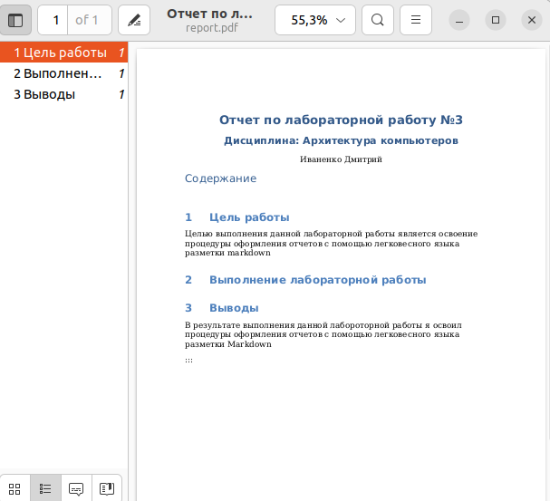{#fig:010 width=70%}

В формате docx: 

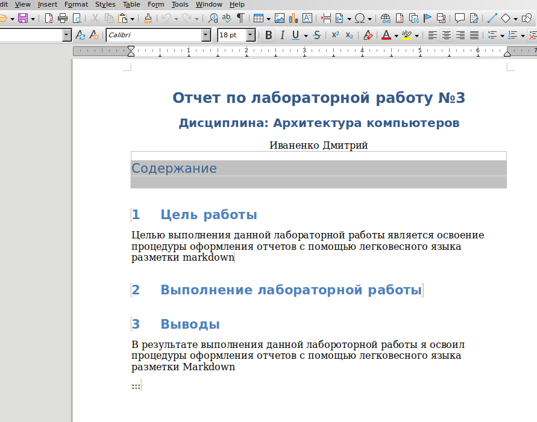{#fig:011 width=70%}

Затем удаляю файлы с использованием команды make clean:

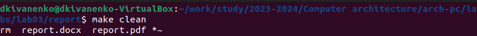{#fig:012 width=70%}

Проверяю:

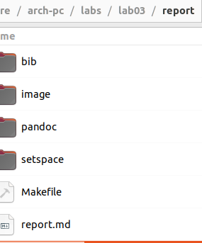{#fig:013 width=70%}

Начинаю заполнять отчет с помощью Markdown в скопированном файле:

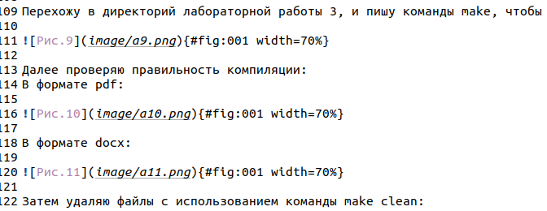{#fig:014 width=70%}

# Выполнение самостоятельной работы

В соответствующем каталоге сделал отчет по лабораторной работе №2 с помощью Markdown.Предоставил отчеты в 3 форматах: pdf, docx и md.

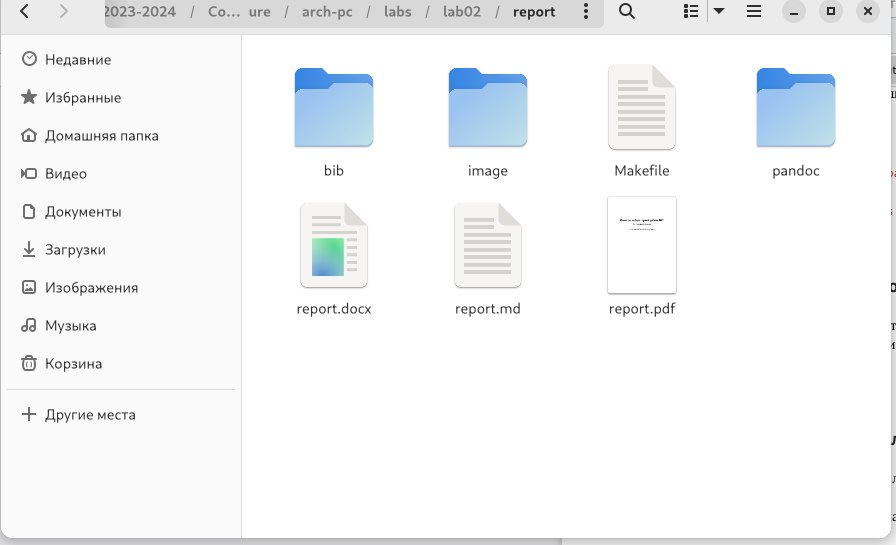{#fig:015 width=70%}

# Выводы

В результате выполнения данной лабораторной работы я освоил процедуры оформления отчетов с помощью легковесного языка разметки Markdown.

:::
