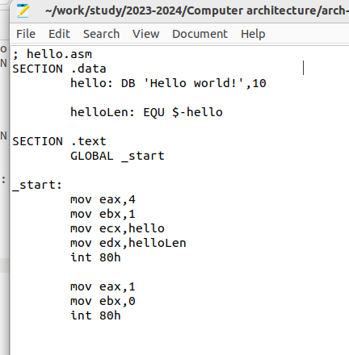
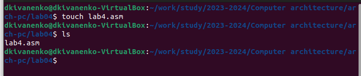
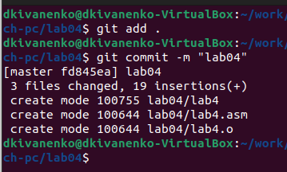

---
## Front matter
title: "Отчет по лабораторной работе №4"
subtitle: "Архитектура компьютера"
author: "Иваненко Дмитрий Кириллович"

## Generic otions
lang: ru-RU
toc-title: "Содержание"

## Bibliography
bibliography: bib/cite.bib
csl: pandoc/csl/gost-r-7-0-5-2008-numeric.csl

## Pdf output format
toc: true # Table of contents
toc-depth: 2
lof: true # List of figures
lot: true # List of tables
fontsize: 12pt
linestretch: 1.5
papersize: a4
documentclass: scrreprt
## I18n polyglossia
polyglossia-lang:
  name: russian
  options:
	- spelling=modern
	- babelshorthands=true
polyglossia-otherlangs:
  name: english
## I18n babel
babel-lang: russian
babel-otherlangs: english
## Fonts
mainfont: PT Serif
romanfont: PT Serif
sansfont: PT Sans
monofont: PT Mono
mainfontoptions: Ligatures=TeX
romanfontoptions: Ligatures=TeX
sansfontoptions: Ligatures=TeX,Scale=MatchLowercase
monofontoptions: Scale=MatchLowercase,Scale=0.9
## Biblatex
biblatex: true
biblio-style: "gost-numeric"
biblatexoptions:
  - parentracker=true
  - backend=biber
  - hyperref=auto
  - language=auto
  - autolang=other*
  - citestyle=gost-numeric
## Pandoc-crossref LaTeX customization
figureTitle: "Рис."
tableTitle: "Таблица"
listingTitle: "Листинг"
lofTitle: "Список иллюстраций"
lotTitle: "Список таблиц"
lolTitle: "Листинги"
## Misc options
indent: true
header-includes:
  - \usepackage{indentfirst}
  - \usepackage{float} # keep figures where there are in the text
  - \floatplacement{figure}{H} # keep figures where there are in the text
---

# Цель работы

Целью данной лабороторной работы является освоение процедуры компиляции и сборки программ, написанных на ассемблере NASM

# Задание

1) Создание программы Hello world!
2) Работа с транслятором NASM
3) Работа с расширенным синтаксисом командной строки NASM
4) Работа с компоновщиком LD
5) Запуск исполняемого файла
6) Выполнение заданий для самостоятельной работы.

# Выполнение лабораторной работы

## Создание программы "Hello world!"

Перемещаюсь в каталог лабороторной работы №4, в котором буду работать (рис.1)

{#fig:001 width=70%}

Далее с помощью команды touch создаю файл hello.asm (рис.2)

Используя текстовый редактор mousepad открываю созданный файл (рис.3)

В файле вставляю код для вывода 'Hello wolrd!' (рис.4)

## Работа с NASM

Использую команду nasm -f elf hello.asm чтобы превратить в объектный код программу 'hello wolrd!', затем проверяю что файл создан (рис.5)

## Работа с расширенным синтаксисом командной строки NASM

Ввожу команду, которая из файла hello.asm сделает файл obj.o (рис.6)

## Работа с компоновщиком LD

Чтобы получить исполняемый файл, я передаю объектный файл hello.o на обработку компоновщику LD, далее проверяю с помощью ls (image/рис.7)

## Запуск исполняемого файла

Запускаю созданный испольняемый файл hello (рис.8)

## Выполнение заданий для самостоятельной работы

Создаю необходимую директорию и перехожу в нее (рис.9)

Создаю новый файл с именем lab4.asm (рис.10)

Далее я использую текстовый редактор mousepad для того, чтобы программа выводила мои имя и фамилию (рис.11)

Компилирую текст программы в объектный файл (рис.12)

Затем передаю объектный файл на обработку компоновщику LD (рис.13)

Далее запускаю файл lab4.asm (рис.14)

С помощью команды git add . и git commit добавляю файлы на github

Отправляю файлы на сервер командой git push

# Выводы

При выполнении данной лабораторной работы я освоил процедуры компиляции и сборки программ, написанных на ассемблере NASM.

