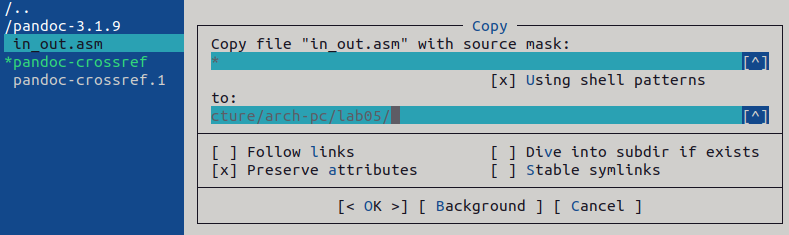
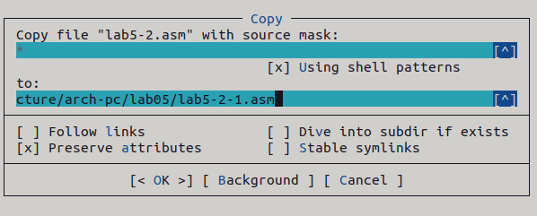

---
## Front matter
title: "Отчет по лабораторной работе №5"
subtitle: "Архитектура компьютера"
author: "Иваненко Дмитрий Кириллович"

## Generic otions
lang: ru-RU
toc-title: "Содержание"

## Bibliography
bibliography: bib/cite.bib
csl: pandoc/csl/gost-r-7-0-5-2008-numeric.csl

## Pdf output format
toc: true # Table of contents
toc-depth: 2
lof: true # List of figures
lot: true # List of tables
fontsize: 12pt
linestretch: 1.5
papersize: a4
documentclass: scrreprt
## I18n polyglossia
polyglossia-lang:
  name: russian
  options:
	- spelling=modern
	- babelshorthands=true
polyglossia-otherlangs:
  name: english
## I18n babel
babel-lang: russian
babel-otherlangs: english
## Fonts
mainfont: PT Serif
romanfont: PT Serif
sansfont: PT Sans
monofont: PT Mono
mainfontoptions: Ligatures=TeX
romanfontoptions: Ligatures=TeX
sansfontoptions: Ligatures=TeX,Scale=MatchLowercase
monofontoptions: Scale=MatchLowercase,Scale=0.9
## Biblatex
biblatex: true
biblio-style: "gost-numeric"
biblatexoptions:
  - parentracker=true
  - backend=biber
  - hyperref=auto
  - language=auto
  - autolang=other*
  - citestyle=gost-numeric
## Pandoc-crossref LaTeX customization
figureTitle: "Рис."
tableTitle: "Таблица"
listingTitle: "Листинг"
lofTitle: "Список иллюстраций"
lotTitle: "Список таблиц"
lolTitle: "Листинги"
## Misc options
indent: true
header-includes:
  - \usepackage{indentfirst}
  - \usepackage{float} # keep figures where there are in the text
  - \floatplacement{figure}{H} # keep figures where there are in the text
---

# Цель работы

Целью данной лабораторной работы является приобретение практических навыков работы в Midnight Commander, освоение инструкций языка ассемблера mov и int.

# Задание

1. Основы работы с mc
2. Структура программы на языке ассемблера NASM
3. Подключение внешнего файла
4. Выполнение заданий для самостоятельной работы

# Выполнение лабораторной работы
## Основы работы с mc

Открываю Midnight Commander, введя в терминал mc (рис. 1).

Перехожу в каталог ~/work/study/2022-2023/"Архитектура Компьютера"/arch-pc, используя файловый менеджер mc (рис. 2)

С помощью функциональной клавиши F7 создаю каталог lab05 (рис. 3).

Перехожу в созданный каталог (рис. 4).

В строке ввода прописываю команду touch lab5-1.asm (рис. 5).

## Структура программы на языке ассемблера NASM

С помощью F4 открываю созданный файл для редактирования в редакторе nano (рис. 6).

Ввожу в файл код программы для запроса строки (рис. 7). Далее выхожу из файла, сохраняя изменения.

Перепроверяю, сохранилось ли (рис. 8).

Транслирую текст программы файла в объектный файл: nasm -f elf lab5-1.asm. Создался объектный файл lab5-1.o. Выполняю компоновку объектного файла с помощью команды ld -m elf_i386 -o lab5-1 lab5-1.o (рис. 9). Создался исполняемый файл lab5-1.

Запускаю исполняемый файл (рис. 10).

## Подключение внешнего файла

Скачиваю файл in_out.asm в ТУИС. Он сохранился в каталог "Загрузки" (рис. 11).

С помощью F5 копирую in_out.asm из каталога Загрузки в созданный каталог lab05 (рис. 12).

С помощью F5 копирую файл lab5-1 в тот же каталог, но с другим именем, для этого в появившемся окне mc прописываю имя для копии файла (рис. 13).

Изменяю содержимое файла lab5-2.asm во встроенном редакторе nano (рис. 14), чтобы в программе использовались подпрограммы из внешнего файла in_out.asm.

Транслирую текст программы файла в объектный файл командой nasm -f elf lab5-2.asm. После этого создался объектный файл lab5-2.o. Выполняю компоновку объектного файла с помощью ld -m elf_i386 -o lab5-2 lab5-2.o Создался исполняемый файл lab5-2. Запускаю его (рис. 15). 

Открываю файл lab5-2.asm. Изменяю в нем sprintLF на sprint и запускаю.(рис. 16).

Разница между первым файлом и вторым в том, что запуск первого запрашивает ввод с новой строки, а программа, которая исполняется при запуске второго, запрашивает ввод без переноса на новую строку, потому что это и есть различие между sprintLF и sprint.

## Выполнение заданий для самостоятельной работы

1. Создаю копию файла lab5-1.asm с именем lab5-1-1.asm с помощью  F5 (рис. 17).

С помощью F4 открываю созданный файл. Изменяю программу так, чтобы она выводила вводимую пользователем строку (рис. 18). 

2. Создаю объектный файл lab5-1-1.o, отдаю его на обработку компоновщику, получаю исполняемый файл lab5-1-1, запускаю полученный исполняемый файл (рис. 19).
 

3. Создаю копию файла lab5-2.asm с именем lab5-2-1.asm с помощью F5 (рис. 20).

С помощью F4 открываю созданный файл . Изменяю программу так, чтобы она выводила вводимую пользователем строку (рис. 21). 

4. Создаю объектный файл lab5-2-1.o, отдаю его на обработку компоновщику, получаю исполняемый файл lab5-2-1, запускаю полученный исполняемый файл (рис. 22).

5. С помощью git add ., git commit -m 'Add files', git push добавляю файлы  в репозиторий GitHub (рис. 23).  

# Выводы

При выполнении данной лабораторной работы я приобрел практические навыки работы в Midnight Commander, а также освоил инструкции языка ассемблера mov и int.

